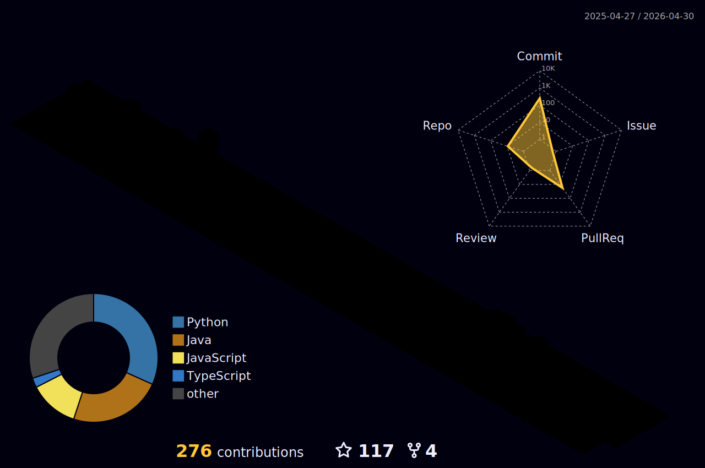

<link rel="stylesheet" type='text/css' href="https://cdn.jsdelivr.net/gh/devicons/devicon@latest/devicon.min.css" />

  
  </a>

I’m Matheus Otenio, a backend-focused software engineer who enjoys designing APIs grounded in real business needs and clear system structure. I care about maintainability and automation, and I like turning loosely defined requirements into reliable, well-organized solutions. While my focus is on backend and system design, I’m comfortable contributing to the frontend when it helps deliver a better product.

## 🖳 Tech Stacks & Tools

  
<b>Java & Spring Ecosystem</b>

   
  

    
    
    
  

  

    
    
    
  
  

  
<b>TypeScript & Node.js Ecosystem</b>

   
  

    
    
    
  

  

    
    
    
    
  

  
<b>Databases, Infra & Common Tools</b>

   
  

    
    
  

  

    
    
    
  

  

    
    
    
  

## 𓂃✍︎ GitHub Activity

  
<b>Github Stats & Languages</b>

   
  

    
    
  

 

  
<b>3D Contribution Graph</b>

##

